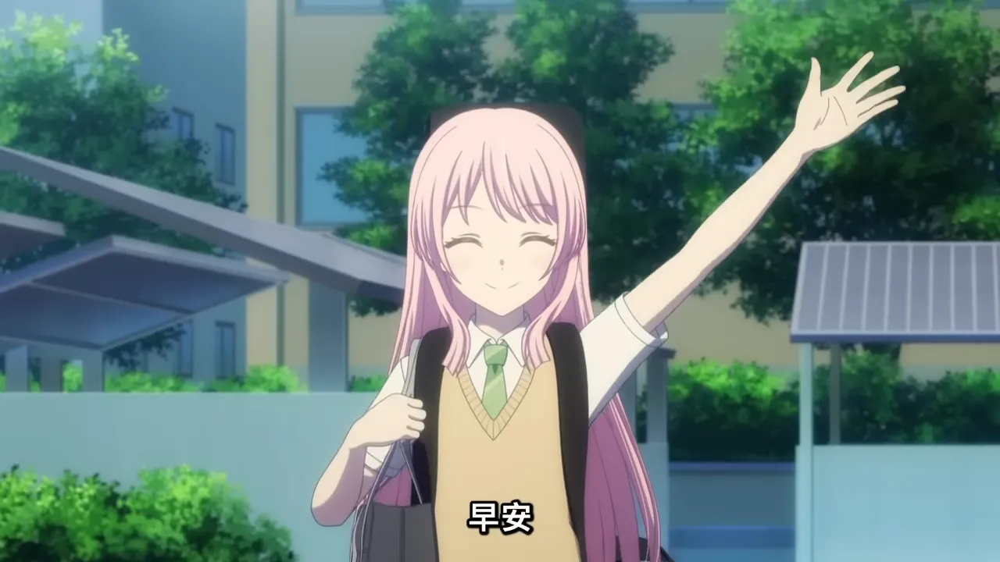
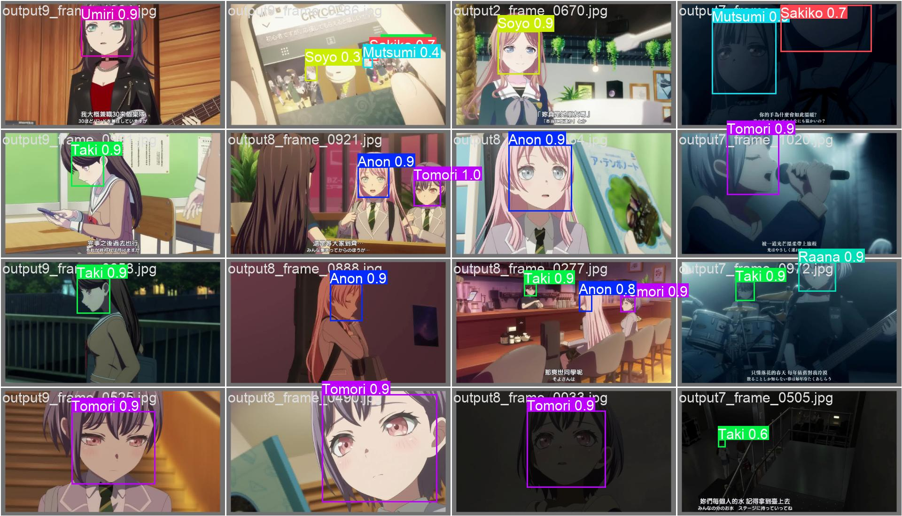
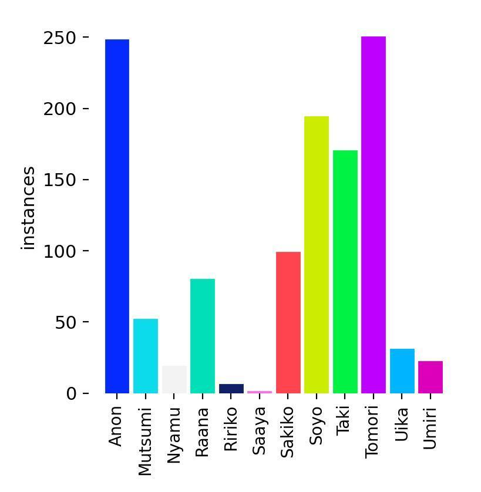
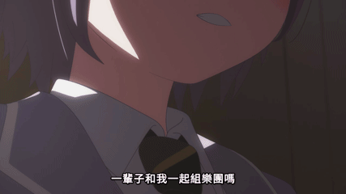

# Yolo MyGO!!!!!

**使用 YOLO 模型進行《BanG Dream! It's MyGO!!!!!》動畫角色的目標檢測**

[DEMO](https://youtu.be/aoLHCHGvWrs)

---

## 📜 目錄

1. [✨ 簡介](#✨-簡介)
2. [🚀 使用方式](#🚀-使用方式)
   - [1. Clone 專案](#1-clone-專案)
   - [2. 安裝套件與環境](#2-安裝套件與環境)
   - [3. 啟用環境](#3-啟用環境)
   - [4. 運行模型測試](#4-運行模型測試)
3. [🛠️ 訓練方式](#🛠️-訓練方式)
   - [1. 資料來源](#1-資料來源)
   - [2. 標註流程](#2-標註流程)
   - [3. 完整流程](#3-完整流程)
4. [🎥 演示](#🎥-演示)
5. [🔗 參考連結](#🔗-參考連結)

---

## ✨ 簡介

Yolo MyGO!!!!! 是一個基於 YOLO 模型的專案，專門針對《BanG Dream! It's MyGO!!!!!》動畫中的角色進行目標檢測。透過此專案，您可以快速部署模型來識別並標註動畫中的各個角色。

---

## 🚀 使用方式

### 1. Clone 專案

首先，將此專案克隆到本地端：

```bash
git clone https://github.com/Joker2377/yolo_MyGO.git
```

### 2. 安裝套件與環境

確保已安裝 [Conda](https://docs.conda.io/en/latest/)，然後創建所需的環境：

```bash
conda env create -f environment.yml
```

### 3. 啟用環境

啟用剛剛創建的 Conda 環境：

```bash
conda activate mygo
```

### 4. 運行模型測試

* 調整 `model_test.py` 中的 `input_path` 變數，指定欲測試的影像或影片路徑。

```bash
python model_test.py
```

> 📖 **更多資訊**：如需進一步了解 `predict` 函式的使用方式，請參考 [Ultralytics 官方文件](https://docs.ultralytics.com/modes/predict/)。

---

## 🛠️ 訓練方式

### 1. 資料來源

- **影像來源**：取自動畫 ***BanG Dream! It's MyGO!!!!!***
- **數量**：手動標註約 250 張影像，作為初始訓練集

### 2. 標註流程

1. 使用 YOLOv11n 模型在 250 張影像上訓練 50 個 epoch，得到初步模型。
2. 使用初步模型推論並自動標註 1000 張影像。
3. 將自動標註結果進行人工微調，獲得更完善的資料集。

### 3. 完整流程

1. **初始訓練**：運行 YOLOv11n 模型進行初步訓練。
2. **自動標註**：使用初步模型對更多影像進行推論，生成自動標註。
3. **資料修正**：檢查並修正自動標註的結果，確保標註品質。
4. **二次訓練**：以修正後的標註資料集，使用 YOLOv11m 模型進行二次訓練，訓練 50 個 epoch。

---

## 🎥 演示

### 模型預測示例




### 標籤分佈



### 標籤角色列表

| 角色名稱 | 圖片 | 角色名稱 | 圖片 | 角色名稱 | 圖片 |
|----------|------|----------|------|----------|------|
| Anon     |  | Mutsumi  |  | Nyamu    |  |
| Raana    |  | Ririko   |  | Saaya    |  |
| Sakiko   |  | Soyo     |  | Taki     |  |
| Tomori   |  | Uika     |  | Umiri    |  |


---

## 🔗 參考連結

- [Ultralytics YOLO 官方文件](https://docs.ultralytics.com/)
- [MyAnimeList - BanG Dream! It's MyGO!!!!! 角色介紹](https://myanimelist.net/anime/54959/BanG_Dream_Its_MyGO/characters)
- [演示影片](https://youtu.be/aoLHCHGvWrs)



